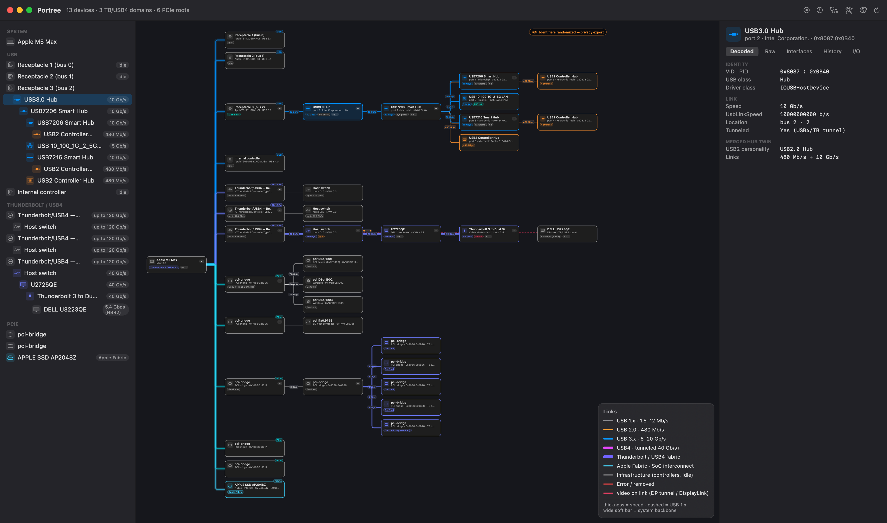
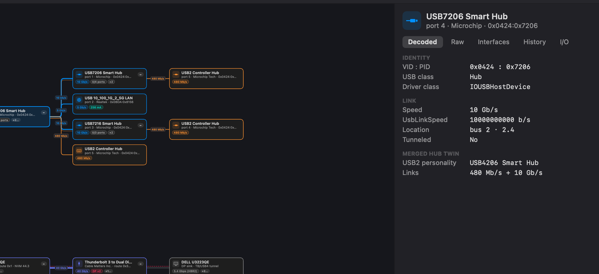

# PorTree

**The most complete picture of everything plugged into your Mac — free.** PorTree renders USB, Thunderbolt/USB4, PCIe, Apple-Fabric NVMe, and every display down to the DP sink behind a dock or adapter as one live, foldable topology graph rooted at the SoC. It measures real throughput and power, grades bottlenecks and overloads with an automatic Doctor, flags never-seen and BadUSB-shaped devices with a persistent trust baseline, diffs hardware states for forensics, and exposes the full raw IORegistry — depth that `ioreg` has and System Information doesn't, with a GUI neither of them has. Free for personal use, and open source.

Pure Swift + SwiftUI. Builds with SwiftPM and the Xcode Command Line Tools alone — no Xcode required, no Electron, no web views. All data comes from IOKit with live hot-plug notifications; nothing is estimated or invented.



Selected-device detail — live I/O while recording, camera capability, power allocation against the port limit, port numbers, and the Doctor's findings as tags:



## Features

| Area | What you get |
|---|---|
| Topology graph | System/SoC node as the root; protocol-colored backbone links fan out to USB controllers, TB/USB4 domains, PCIe bridges, and Apple-Fabric NVMe. Foldable subtrees (+N pills), drag-to-pan, pinch / ⌘-wheel zoom anchored at the cursor, two layout directions, selectable canvas background. View state persists across launches |
| Link encoding | Color = protocol tier (USB 1.x/2.0/3.x/USB4/TB/Apple Fabric), thickness = speed, dashed = low-speed, pink companion line = video on the link (DP tunnel or DisplayLink), red = Doctor-flagged bottleneck. Speed is always printed as text too; persistent legend |
| Thunderbolt / USB4 | Native fabric tree: switches, route strings, NVM versions, trained link speed up to TB5 120 Gb/s, DP-IN vs DP-OUT adapter classification (monitors get display icons, adapters don't), cable chains |
| PCIe / NVMe | Bridges and devices with link generation + lane width from the Express registers; internal (Apple Fabric) and enclosure NVMe as storage nodes with model/firmware/serial and honest interconnect labeling |
| Port occupancy | Per-hub used/total port counts with the free port *numbers* ("free: 2, 5"), port-number labels on attached devices |
| Inspector | Five tabs per node: curated decode, the complete raw property table with hex viewer for descriptor blobs, interfaces with owning driver/pid, per-device history, live I/O chart |
| Hot-plug | Arrival glow, 4 s removal ghosts, re-enumeration collapse (unplug/replug shows one amber pulse, not ghost + new node), flood-coalesced event log persisted as JSONL |
| Baseline diff | Freeze the current state — or load a saved snapshot JSON — then compare against live after any change: added / removed / changed devices, keyed by device identity so old baselines still match. The "why is there a new HID device" button |
| Record mode | 1 Hz sampling of real byte counters (storage, network interfaces) — per-node sparklines, animated flow along busy links, aggregate traffic strip with top talkers. Devices without counters show nothing rather than estimates |
| Live power | Rides the record tick: per-device allocation history (renegotiation steps chart), always-on mA chips with subtree Σ on hubs, allocation gauge vs the port's real current limit — and a kernel **overcurrent-counter watch** that flashes the node red and logs an alert the second actual overdraw is detected |
| Displays & cameras | Monitors get resolution/refresh/connection and the negotiated DP link rate (registry DP sinks joined to live screens by EDID identity, never by name). Monitors with built-in hubs are labeled display-first with a "built-in hub" chip. A plain-DP/HDMI monitor behind a TB→DP adapter — invisible to the USB/TB topology — gets a **dedicated display node** grafted under the adapter that provably drives it, built from its own registry sink entry (EDID name, lanes, link rate, connector type). A sidebar **Displays** section lists every screen — click one to spotlight its node. UVC cameras get max format/fps and a live **IN USE** flag when another app is streaming |
| Display adapters | TB→DP/HDMI adapters show **display-output occupancy** ("DP out 1/2", from per-output hot-plug-detect state); USB-C alt-mode dongles are detected via their billboard device (class 0x11) with a distinct adapter tag; DisplayLink devices are labeled as compressed driver-rendered video, distinct from tunneled DP (other USB-graphics vendors share their VIDs with flash controllers and are deliberately not guessed). Display config changes trigger an automatic rescan |
| Host summary | Measured from the registry: TB generation and per-port bandwidth, port count, USB controller count/revision, active DP tunnels; reference-table chip specs (max displays) where known, with an explicit note when a chip has no entry |
| Tags | Every fact a node carries as readable chips: compact row with +N overflow on cards (expandable per card or all at once), the full set mirrored large in the inspector |
| Identify | One click searches the web for the selected device's `vid:pid` + name — the fastest "what is this thing" for unknowns; right-click copies the device name or canonical ID (USB vid:pid, PCI vendor:device, TB UID) |
| Device guard | On by default: the first run learns every attached device as the trusted baseline; afterwards any **never-seen device** is flagged red in graph + sidebar with a distinct alert sound and log entry until you right-click → *Trust this device* (or *Trust All Connected Devices*). Serial-less devices keep trust across port moves, but a serial-less clone of a serial-bearing known device does **not** pass |
| Connection sounds | Optional beeps: plug/unplug, alerts (overcurrent, new keyboard-class device, unknown device) — one beep per event batch, toggleable |
| Sidebar modes | Topology tree, or a **by-type filter** (input, storage, cameras, network, …) where clicking a device spotlights it in the graph with the same fade-out focus as search |
| Search | Live filter keeping ancestors, graph glow, match counter, ⌘G cycles through hits |
| Appearance | Dark/Light/System app appearance, selectable canvas background, adjustable UI font scale (⌥⌘±), view state persisted |
| Export | Snapshot JSON (⇧⌘E), graph PNG/JPEG, reproducible full-app screenshot — all also available headless (below) |
| Toolbox | Curated `ioreg` / `log` / `system_profiler` / `pmset` debugging commands with one-click copy and in-app run for the read-only ones |

## Compared

Feature rows extend the comparison table on the Hubble product page. [Hubble](https://www.gingerbeardman.com/apps/hubble/), [Manifold](https://github.com/holdmysocks/Manifold), and [WhatCable](https://github.com/darrylmorley/whatcable) are the other macOS GUI topology tools; System Information and `ioreg` are the built-ins. Third-party columns reflect those tools' own published feature lists.

| Feature | PorTree | Hubble | Manifold | WhatCable | System Info | ioreg |
|---|:-:|:-:|:-:|:-:|:-:|:-:|
| Topology view | ✓ graph | ✓ graph | ✓ tree | ✓ menu tree | – | text |
| Interactive canvas (pan/zoom/fold) | ✓ | ✓ | – | – | – | – |
| Live hot-plug updates | ✓ | ✓ | ✓ | ✓ | – | – |
| Speed-coded links | ✓ | ✓ | partial | partial | – | – |
| Link-mismatch / throttle detection | ✓ | ✓ | ✓ | – | – | – |
| Graded diagnostics (power, TT, depth, oversubscription) | ✓ | ✓ | partial | – | – | – |
| Native TB/USB4 fabric (switches, routes, NVM, TB5) | ✓ | – | partial | ✓ | partial | raw |
| PCIe · NVMe · Apple Fabric | ✓ | – | – | – | partial | raw |
| Raw IORegistry properties + hex view | ✓ | – | – | – | – | ✓ |
| Interfaces with owning driver/pid | ✓ | – | – | – | – | partial |
| Port occupancy / free ports | ✓ | ✓ | ✓ | – | – | – |
| Physical port positions (left/right) | – | ✓ | ✓ | – | – | – |
| Live throughput graphs (storage/network) | ✓ | – | – | – | – | – |
| Power allocation history + overcurrent alerts | ✓ | partial | – | – | – | – |
| Display & camera modes (res/fps, in-use) | ✓ | – | – | partial | – | – |
| DP-sink display nodes + adapter output occupancy | ✓ | – | – | – | – | raw |
| Baseline snapshot diff | ✓ | – | – | – | – | – |
| Unknown-device guard (trusted baseline, BadUSB heuristics) | ✓ | – | – | – | – | – |
| Persisted event log | ✓ | – | – | – | – | – |
| Web device identification | ✓ | ✓ | – | – | – | – |
| Headless CLI (JSON / images) | ✓ | – | – | – | partial | ✓ |
| Device nicknames / eject | – | ✓ | – | – | – | – |
| Intel Macs | untested¹ | ✓ | – | ? | ✓ | ✓ |
| License | free, noncommercial | $9.99 | free, OSS | freemium | built-in | built-in |

¹ Builds target macOS 15+; the registry keys are verified on Apple Silicon (macOS 26/27). CLI siblings worth knowing: [cyme](https://github.com/tuna-f1sh/cyme), usbtree, and mactop's TB tree.

## Diagnostics

The Doctor re-runs automatically on every topology change and grades findings as note / warning / problem. Each finding names the device, explains the cause, and is click-to-jump from the central diagnostics panel (stethoscope toolbar button with a live count).

- **Throttled by upstream link** — a device negotiated below its capability because an upstream hop is slower; the limiting link turns red
- **Hub bottlenecked by upstream** — a capable hub on a weaker link, flagged as a shared bottleneck for everything behind it
- **Uplink bandwidth oversubscribed** — the devices behind a hub can collectively demand more than its uplink carries; explicitly labeled as the theoretical worst case from negotiated speeds (record mode shows live usage), co-existing with the per-device rules
- **Below rated speed** — negotiated under provable capability with no upstream culprit (cable/port suspect)
- **TB link trained below capability** — a TB5-class port running at 40/80 Gb/s (cable or peer limit)
- **Power budget** — subtree draw vs the port's real current limit, with an early warning at 80% and a problem when oversubscribed
- **Overcurrent events** — the kernel's per-port overcurrent counter, attributed to the attached device
- **Enumeration/address failures and SuperSpeed link errors** — per-port counters since boot (flaky cable forensics)
- **Hub chain depth** — warning one tier before the controller's tier limit ("one more hub level will fail to enumerate"), problem at the limit
- **Single-TT contention** — multiple low/full-speed devices sharing one transaction translator
- **No free ports** — a fully occupied hub
- **Input-device anomalies** — a keyboard interface paired with mass storage on one device (the classic BadUSB/keystroke-injection carrier, problem), a keyboard interface on a device that doesn't present as a keyboard (warning), and a note on every keyboard-class device when more than one can type into the Mac. A keyboard-class hot-plug always raises an alert event

Separate from the Doctor, the **device guard** keeps a persistent known-devices list (`Application Support/Portree/known-devices.json`) and flags anything never seen on this Mac before — see Features.

Rules only fire on provable inputs; a rule that can't prove its data stays silent.

## USB security

PorTree doubles as a USB security monitor — the same registry truth, pointed at the attack surface. Everything is local; nothing leaves the machine.

- **Device guard** (on by default) — the first launch learns every attached device as the trusted baseline (`~/Library/Application Support/Portree/known-devices.json`). From then on, any device this Mac has *never seen* flashes red in the graph and sidebar, plays a distinct alert sound, and stays flagged until you right-click → **Trust this device** (or *Trust All Connected Devices* to re-learn). Removals never alert — only unknown arrivals do.
- **Identity rules that resist spoofing-by-omission** — a serial-less device keeps its trust across port moves, but a serial-less clone of a serial-bearing known device does **not** pass.
- **Keystroke-injection (BadUSB) heuristics** — the Doctor flags a keyboard interface paired with mass storage on one device (the classic rubber-ducky payload carrier, problem), a keyboard interface on a device that doesn't present as a keyboard (warning), and notes every keyboard-class device when more than one can type into this Mac. Every keyboard-class hot-plug raises an alert event with a sound — trusted or not.
- **Baseline diff forensics** — freeze or save a known-good hardware state and compare after travel, servicing, or a borrowed dock: added / removed / changed devices keyed by hardware identity, built for the "why is there a new HID device" moment.
- **Persisted evidence** — the full event log (connects, disconnects, flapping storms, alerts) is written as JSONL under Application Support for later review.
- **Unknown-device workflow** — spotlight the flagged device, open its raw descriptors and interfaces (*what can this thing actually do?*), web-search its vid:pid, then trust it or unplug it.

## Requirements

- macOS 15+ (registry keys verified on macOS 26/27, Apple Silicon)
- Xcode Command Line Tools (full Xcode works too; CI builds on GitHub's arm64 runners)
- No entitlements, no sudo, no TCC prompts — reading the IORegistry needs none

## Installing

Grab `PorTree-*.zip` from [Releases](../../releases) — versioned tags plus a rolling `nightly` built from every push to `main`. Builds are ad-hoc signed: right-click → Open on first launch.

## Building

```sh
make run      # build and launch (debug)
make test     # unit tests (swift-testing)
make app      # assemble ad-hoc-signed dist/Portree.app
make icon     # regenerate the app icon
```

The Makefile auto-detects the environment: on CLT-only Macs it pins `SDKROOT` and loads the swift-testing macro plugin explicitly (see [DESIGN.md §8](DESIGN.md)); with full Xcode it uses plain toolchain paths.

## CLI

Flags combine — one registry capture serves all outputs:

```sh
portree --dump > snapshot.json
portree --export-graph graph.png
portree --export-screenshot shot.png
portree --dump --export-graph g.png --export-screenshot s.png > snap.json
```

## Design notes

[DESIGN.md](DESIGN.md) documents the architecture and the IOKit data layer (registry planes, hub-twin merging via ContainerID, hot-plug notification pitfalls, TB route-string/UID decoding); [PLAN.md](PLAN.md) tracks milestones and known gaps. Two principles hold throughout: the registry is the only data source (`system_profiler SPUSBDataType` returned an empty array on the development machine while the registry held 21 devices), and nothing is displayed that can't be proven from it.

## Author

Hamid Kashfi — [@hkashfi](https://x.com/hkashfi)

## License

[PolyForm Noncommercial 1.0.0](LICENSE.md) — free to use, modify, and share for any noncommercial purpose; commercial use is not licensed. © 2026 Hamid Kashfi.
